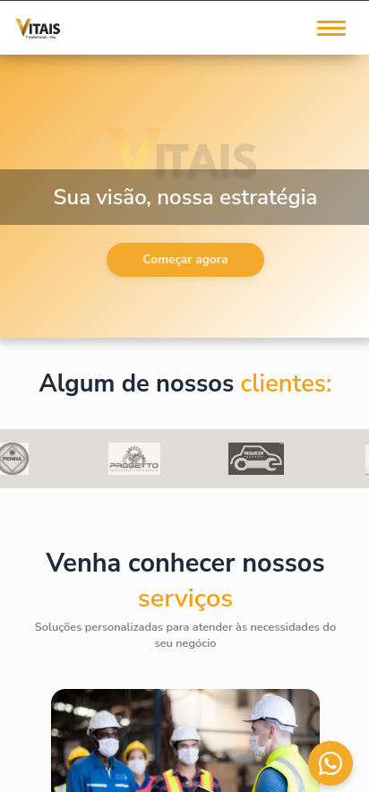

<h1 align="center">🌿 Site Vitais</h1>

Site desenvolvido para uma empresa de consultoria da minha cidade, pensado para atender às necessidades visuais e de conteúdo solicitadas pela cliente.

  
  
  
  

---

## 📖 Resumo do projeto

O projeto teve início com a criação do layout no **Figma**, feito em conjunto com a designer parceira. Cada etapa do design foi submetida para aprovação da cliente antes de seguir para o desenvolvimento.

Após a aprovação, iniciei a codificação utilizando **React** e **TypeScript**, tecnologias onde já tenho boa experiência e que garantem flexibilidade e performance para aplicações modernas.

Busquei ferramentas e APIs para um desenvolvimento viável sem custar muito ao cliente, como EmailJS, e fiz o deploy sozinho assim como configurei para https e dns 

---

## 📸 Demonstração

---

## 📦 Tecnologias utilizadas

- React
- TypeScript
- Vite
- EmailJS
- Deploy via Hostoo / Cloudflare Pages

---

## 🛠️ Como rodar o projeto

### 🔍 Clone o repositório:

No bash dê  
git clone https://github.com/pedromoitinho/janainaSite.git

## 📂 Acesse a pasta do projeto:

cd janainaSite

## 📦 Instale as dependências:

npm install

## 🚀 Rode o projeto em ambiente de desenvolvimento:

npm run dev

## 📤 Faça o deploy:

npm run deploy

## 📄 Licença

MIT License

Copyright (c) 2024 Pedro Moitinho

Permission is hereby granted, free of charge, to any person obtaining a copy
of this software and associated documentation files (the "Software"), to deal
in the Software without restriction, including without limitation the rights
to use, copy, modify, merge, publish, distribute, sublicense, and/or sell
copies of the Software, and to permit persons to whom the Software is
furnished to do so, subject to the following conditions:

The above copyright notice and this permission notice shall be included in all
copies or substantial portions of the Software.

THE SOFTWARE IS PROVIDED "AS IS", WITHOUT WARRANTY OF ANY KIND, EXPRESS OR
IMPLIED, INCLUDING BUT NOT LIMITED TO THE WARRANTIES OF MERCHANTABILITY,
FITNESS FOR A PARTICULAR PURPOSE AND NONINFRINGEMENT. IN NO EVENT SHALL THE
AUTHORS OR COPYRIGHT HOLDERS BE LIABLE FOR ANY CLAIM, DAMAGES OR OTHER
LIABILITY, WHETHER IN AN ACTION OF CONTRACT, TORT OR OTHERWISE, ARISING FROM,
OUT OF OR IN CONNECTION WITH THE SOFTWARE OR THE USE OR OTHER DEALINGS IN THE
SOFTWARE.

 <strong>👨‍💻 Autor</strong>

 <strong>Pedro Moitinho</strong>  <a href="https://github.com/pedromoitinho" target="_blank">GitHub</a> <a href="https://www.linkedin.com/in/pedrohmoitinho/" target="_blank">Linkedin</a> 

